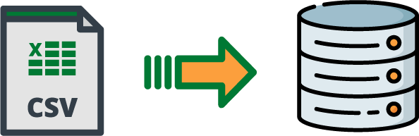

<p align="center">

</p>


# CSV to DB
**install with: pip install csvtodb**
With this package you will be able to get info from a csv file like the column name, or specific row, and update 
your file with the possibility to add row or column.

The most important with this tool is you can easily transform your csv to, 
SQL scripts to build table or create seeder for your database (you can build them both in the same file).

## Supported
### DBMS
<table>
  <thead>
    <tr>
      <th>DBMS</th>
      <th>Engine</th>
      <th>>= Ver.</th>
    </tr>
  </thead>
  <tbody>
    <tr>
      <td>Mysql</td>
      <td><ul>
        <li>Innodb</li>
        <li>MyISAM</li>
        <li>Memory</li>
        <li>CSV</li>
      </ul></td>
    <td>8.0</td>
    </tr>
  </tbody>
</table>

### Framework
<table>
  <thead>
    <tr>
      <th>Framework</th>
      <th>>= Ver.</th>
    </tr>
  </thead>
  <tbody>
    <tr>
      <td>Laravel</td>
      <td>8.x</td>
    </tr>
  </tbody>
</table>

## CSV
### Features
- Get total columns in the file
- Get list of rows
- Get column content
- Get column name
- Get total rows in the file
- Update column name
- Set new row
- Update row
- Build json file
- Format column name to get right syntax (remove whitespace)
- Getter and setter for:
  - filename 
  - filepath
  - delimiter
  - quotechar

## How to build your csv
Your csv must respect some rules to be understandable correctly and for everything to works well

### Column name
Column name whitespace needs to be replaced by **underscore** like => column_name
method in this package can format them too

### Date type 
The syntax for the date must be one of those to be detected like date:
- dd/mm/yyyy 00:00:00
- dd/mm/yyyy
- yyyy
- 00:00:00

### Number which have to be string
Example for a product reference if you want it to be string value you have to add
non-numeric value like => '456789132'

### Primary key
generate automatically don't worry

### Foreign key
For the foreign key column name must be => tableReference_id

## Usage
### DBMS
Example with mysql:
#### Build new db

````python
from mysql.Mysql import Mysql

Mysql.new_db(save_in='filepath', db_name='db_name', files={
    'filepath1': (
        ('filename1', 'delimiter', 'quotechar'),
        ('filename2', 'delimiter', 'quotechar'),
    ),
    'filepath2': (
        ('filename1', 'delimiter', 'quotechar'),
        ('filename2', 'delimiter', 'quotechar'),
    ),
    # etc...
})
````

#### Build new table

````python
from csvtodb.Csv import Csv
from mysql.Mysql import Mysql

csv = Csv(filename='filename', filepath='filepath')

# engine is optional the default value is InnoDB
# You can add temporary too which is optional default value is False
Mysql.new_table(csv=csv, filename='filename', filepath='filepath', engine='InnoDB')
````

#### Build multiple table

````python
from csvtodb.Csv import Csv
from mysql.Mysql import Mysql

csv = Csv(filename='filename', filepath='filepath')
Mysql.new_tables(filepath='save_in', filename='sql_filename', files={
    'filepath1': (
        ('filename1', 'delimiter', 'quotechar'),
        ('filename2', 'delimiter', 'quotechar'),
    ),
    'filepath2': (
        ('filename1', 'delimiter', 'quotechar'),
        ('filename2', 'delimiter', 'quotechar'),
    ),
    # etc...
}, engine='INNODB')  # engine default value is INNODB
````

#### Build new seeder

````python
from csvtodb.Csv import Csv
from mysql.Mysql import Mysql

csv = Csv(filename='filename', filepath='filepath')
Mysql.new_seeder(csv=csv, filename='filename', filepath='filepath')
````

### Framework
example with Laravel (absolute path is recommended to avoid error):

#### Build new migration file

````python
from csvtodb.Csv import Csv
from laravel.Laravel import Laravel

csv = Csv(filename='data_test', filepath='csv_file')
Laravel.new_migration(csv=csv,
                      filepath='laravel_migration_folder',
                      filename='laravel_migration_filename')
````

#### Build new seeder file

````python
from csvtodb.Csv import Csv
from laravel.Laravel import Laravel

csv = Csv(filename='data_test', filepath='csv_file')
Laravel.new_seeder(csv=csv,
                   filepath='laravel_migration_folder',
                   filename='laravel_migration_filename')
````

#### Build new seeder file

````python
from csvtodb.Csv import Csv
from laravel.Laravel import Laravel

csv = Csv(filename='data_test', filepath='csv_file')
Laravel.new_seeder(csv=csv,
                   filepath='laravel_migration_folder',
                   filename='laravel_migration_filename')
````

## GUI APP
If you only want to convert it without coding you can use the gui app available with qt.ui for QtDesigner file
if you want to modify the ux/ui it as you want ! ^^

For downloading the gui you only need to download the .rar in gui folder